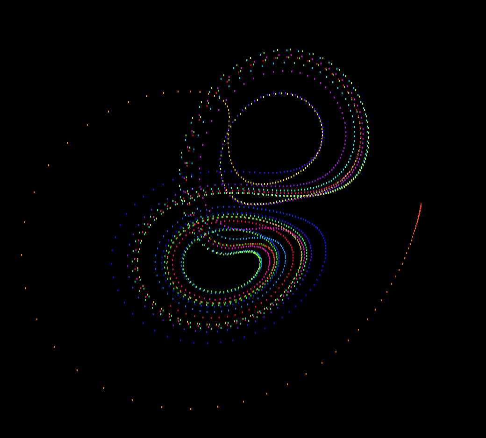

# Lorenz-attractor---pygame

A simply game made in Pygame

## 🌆 Overview

<div align="center">
    
</div>

## 👾 Execute

### Install Dependencies
```bash
pip install pygame
```

[if your python version is 3.12+, try:](https://github.com/pygame/pygame/issues/4712)

```bash
python -m pip install pygame-ce
```

```bash
python main.py
```

if you get any error, try:

```bash
python3 main.py
```

## ❤️ Support me
Please subscribe to my youtube channel: [Auctux](https://www.youtube.com/channel/UCjPk9YDheKst1FlAf_KSpyA)
